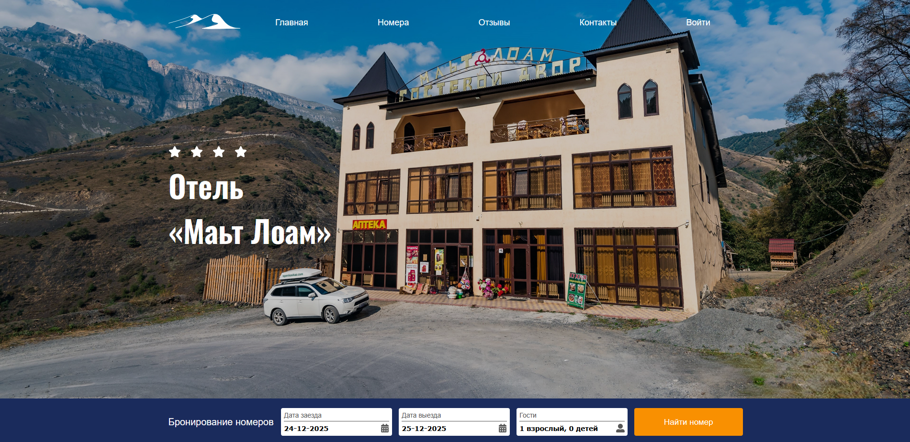

# Hotel Booking System — Full-Stack Web Application

<!-- 📸 Главный экран приложения -->

  

> 🔹 Здесь отображается главный экран клиентской части приложения (страница бронирования)

Полнофункциональное веб-приложение для отеля с кастомной системой онлайн-бронирования.  
Проект охватывает полный цикл разработки: от бизнес-логики бронирования до развертывания на VPS и базовой SEO-оптимизации.

## 📌 Описание проекта

Приложение предназначено для автоматизации процесса бронирования номеров в отеле.  
Система исключает двойные продажи, упрощает работу персонала и предоставляет гостям удобный личный кабинет для управления бронированиями.

Реализованы два независимых интерфейса:
- **Клиентский интерфейс** — для гостей отеля
- **Административная панель** — для управления номерным фондом и бронированиями

## 🧩 Основной функционал

### Для гостей
- Просмотр доступных номеров
- Онлайн-бронирование на выбранные даты
- Проверка доступности номеров в реальном времени
- Личный кабинет с просмотром статуса брони

### Для администратора
- Управление номерным фондом (создание, редактирование, удаление)
- Подтверждение и отмена бронирований
- Просмотр всех бронирований
- Контроль загрузки отеля

## 🛠 Технологический стек

**Frontend**
- Next.js
- React
- SEO-оптимизация (meta-теги, семантическая разметка)

**Backend**
- Node.js
- Express.js
- MySQL

**Инфраструктура**
- VPS
- Ручное развертывание и настройка сервера
- Настройка стабильной работы backend и frontend

## ⚙️ Реализация и архитектура

- Полный цикл разработки full-stack приложения
- Кастомная логика бронирования:
  - Алгоритм проверки доступности номеров по датам
  - Исключение пересечений бронирований
- Разделение ролей и интерфейсов (гость / администратор)
- REST API для взаимодействия frontend и backend
- Работа с реляционной базой данных (MySQL)

## 📊 Масштаб проекта

- 30 номеров
- Кастомная система бронирования
- 2 типа интерфейсов (клиентский и административный)

## 📈 Результаты и метрики

- Полностью автоматизирован процесс бронирования
- Исключены двойные продажи номеров
- Существенно снижена нагрузка на персонал отеля
- Улучшена индексируемость сайта в поисковых системах

## 🔗 Репозитории проекта

- **Frontend:**  
  https://github.com/amart302/mattloam-client

- **Backend:**  
  https://github.com/amart302/mattloam-server

## 🚀 Статус проекта

Проект завершён и используется как production-ready решение.  
Возможны дальнейшие улучшения: онлайн-оплата, уведомления, аналитика.
